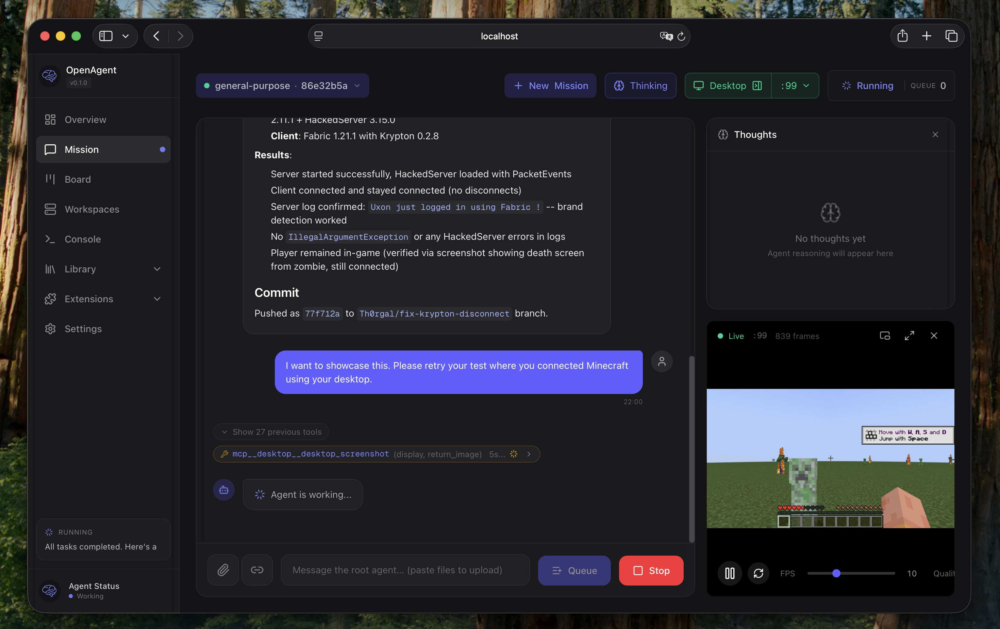

<p align="center">
  
</p>

<h1 align="center">Open Agent</h1>

<p align="center">
  <strong>Self-hosted control plane for AI autonomous agents</strong><br/>
  Isolated Linux workspaces and git-backed Library configuration
</p>

<p align="center">
  <a href="#vision">Vision</a> ·
  <a href="#features">Features</a> ·
  <a href="#ecosystem">Ecosystem</a> ·
  <a href="#screenshots">Screenshots</a> ·
  <a href="#getting-started">Getting Started</a>
</p>

<br/>

<p align="center">
  
</p>

---

## Vision

What if you could:

**Hand off entire dev cycles.** Point an agent at a GitHub issue, let it write code, test by launching a Minecraft server, and open a PR when tests pass. You review the diff, not the process.

**Run multi-day operations unattended.** Give an agent SSH access to your home GPU through a VPN. It reads Nvidia docs, sets up training, fine-tunes models while you sleep.

**Keep sensitive data local.** Analyze your sequenced DNA against scientific literature. Local inference, isolated containers, nothing leaves your machines.

---

## Features

- **Mission Control**: Start, stop, and monitor agents remotely with real-time streaming
- **Isolated Workspaces**: Containerized Linux environments (systemd-nspawn) with per-mission directories
- **Git-backed Library**: Skills, tools, rules, agents, and MCPs versioned in a single repo
- **MCP Registry**: Global MCP servers running on the host, available to all workspaces
- **Multi-platform**: Web dashboard (Next.js) and iOS app (SwiftUI) with Picture-in-Picture

---

## Ecosystem

Open Agent is a control plane for [**OpenCode**](https://github.com/anomalyco/opencode), the open-source AI coding agent. It delegates all model inference and autonomous execution to OpenCode while handling orchestration, workspace isolation, and configuration management.

Works great with [**oh-my-opencode**](https://github.com/code-yeongyu/oh-my-opencode) for enhanced agent capabilities and prebuilt skill packs.

---

## Screenshots

<p align="center">
  
</p>
<p align="center"><em>Real-time monitoring with CPU, memory, network graphs and mission timeline</em></p>

<br/>

<p align="center">
  
</p>
<p align="center"><em>Git-backed Library with skills, commands, rules, and inline editing</em></p>

<br/>

<p align="center">
  
</p>
<p align="center"><em>MCP server management with runtime status and Library integration</em></p>

---

## Getting Started

### Production Setup (the easy way)

1. Get a dedicated server (e.g., [Hetzner](https://www.hetzner.com/), Ubuntu 24.04)
2. Point a domain to your server IP
3. Clone this repo locally
4. Ask Claude to set it up:
   > "Please deploy Open Agent on my server at `<IP>` with domain `agent.example.com`"

That's it. Claude will handle nginx, SSL, systemd services, and everything else.

If you feel smarter than the AI, check out **[INSTALL.md](./INSTALL.md)**.

### Local Development

**Backend**:
```bash
export OPENCODE_BASE_URL="http://127.0.0.1:4096"
cargo run
```

**Dashboard**:
```bash
cd dashboard
bun install
bun dev
```

Open `http://localhost:3001`

---

## Status

**Work in Progress** — This project is under active development. Contributions and feedback welcome.

## License

MIT
