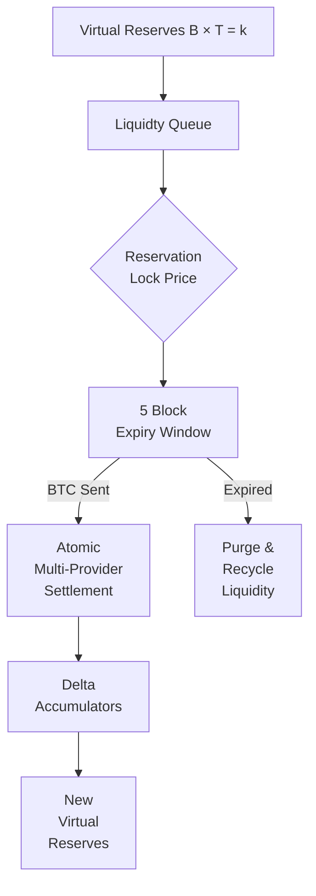

# Swap Slippage Control Mechanism Analysis

## Key Components from [btc-vision/native-swap](https://github.com/btc-vision/native-swap)

### 1. Virtual Reserve Accounting (docs/NativeSwap.md)
```math
B \times T = \text{constant}
```
- `virtualBTCReserve` (B) and `virtualTokenReserve` (T) track cumulative value
- Price calculated as: `B ÷ T` before trades
- Large trades shift price through formula, creating *natural slippage* that protects pool from depletion

### 2. Reservation System (README.md 45, docs/NativeSwap.md)
1. **Phase 1**: `reserveLiquidity()` locks price quote for 5 blocks
2. **Phase 2**: Actual BTC transfer occurs
3. **Expiration**: Reservations auto-cancel after 5 blocks if not finalized

### 3. Block-Based Price Updates (docs/NativeSwap.md)
- Price updated once per block via `updateVirtualPoolIfNeeded()`
- Uses delta accumulators (`deltaTokensBuy`, `deltaBTCSell`, etc.) for:
  - Add liquidity
  - Token purchases
  - Token sales
- Finalizes price changes at block boundary to prevent intra-block slippage

### 4. Anti-Manipulation Constraints
- `maxReservesIn5BlocksPercent`: Caps reservations to 40-70% of liquidity (docs/NativeSwap.md #230)
- `minimumTradeSize` prevents trivially small trades
- `antiBotMaximumTokensPerReservation` limits single reservation size
- CSV timelocks prevent transaction pinning attacks

### 5. Slippage Protection Mechanisms
- **No Reverts**: BTC transactions are final - protocol only executes trades when:
  - Reservation matches actual BTC amount
  - All tokens from queue are filled atomically
- **Partial Fill Logic**: Fails entire trade if any provider in the queue can't fulfill commitment
- **Purge Mechanism**: Recycles unclaimed tokens from failed reservations

### Visual Representation


## Security Considerations
- **Front-running prevention**: Block-based updates eliminate time-based price manipulation
- **Queue Impact Pricing**: Logarithmic adjustments for seller concentration
- **Slashing Penalties**: Up to 90% token loss for cancelled reservations
- **CSV Timelocks**: Prevent BTC chain attacks through enforced settlement delays

[Read complete docs](https://github.com/btc-vision/native-swap)